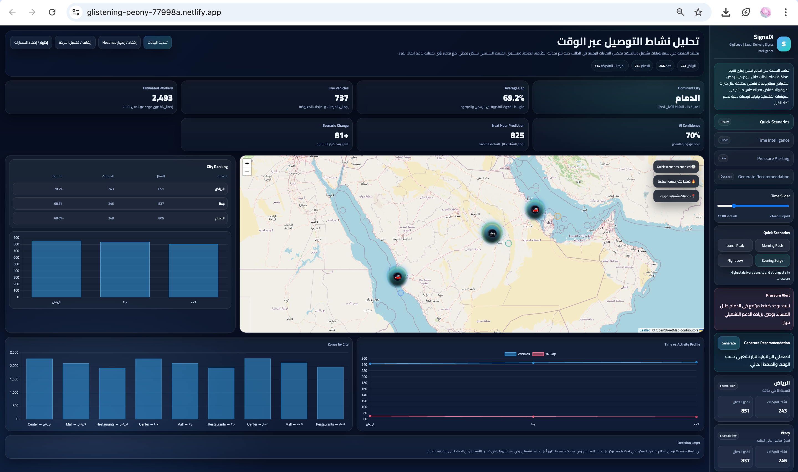
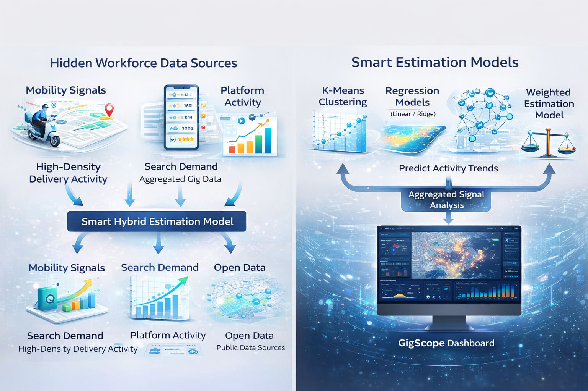
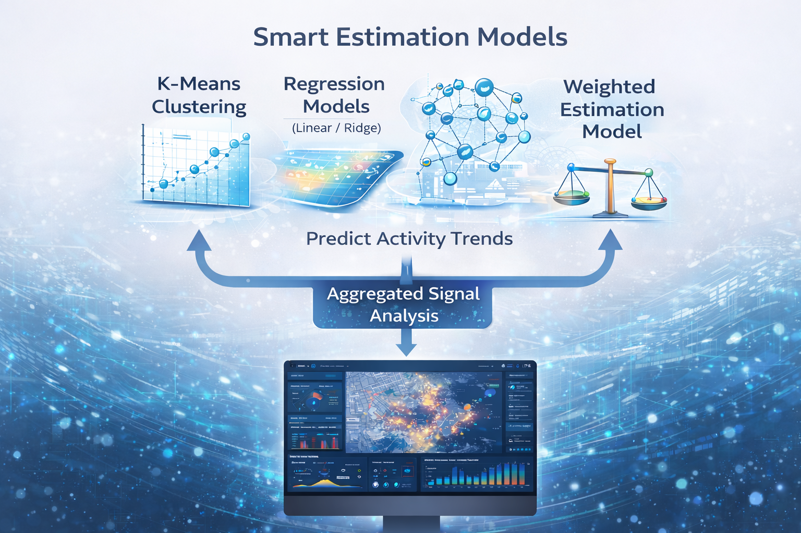

# 📡 GigScope AI Observatory  
### Turning Invisible Workforce into Actionable Intelligence

---

## 🌍 The Problem

In every city, thousands of gig workers operate daily — yet they remain **invisible in official statistics**.

This leads to:

- ❌ Inaccurate workforce estimates  
- ❌ Inefficient urban planning  
- ❌ Weak economic decision-making  

> **What is not measured… cannot be managed.**

---

## 💡 The Solution — GigScope

**GigScope** is an AI-powered observatory that transforms scattered, indirect signals into **real-time workforce intelligence**.

Instead of tracking individuals, GigScope analyzes patterns using:

- 📍 Mobility signals  
- 🔍 Search demand indicators  
- 📊 Aggregated platform activity  
- 🌐 Open data sources  

---

## 📡 Data Sources

GigScope combines multiple indirect data signals to estimate workforce activity without relying on traditional records.

---

## 🧠 AI Models

GigScope applies advanced AI models to transform signals into accurate insights:

- K-Means Clustering  
- Regression Models (Linear / Ridge)  
- Classification Models  
- Weighted Estimation Model  

---

## 🚀 Live Experience

### 🌐 Interactive Dashboard  
👉 https://glistening-peony-77998a.netlify.app  

### 🎬 Demo Video  
👉 https://youtu.be/VdJCsfWqFGQ  

---

## ⚙️ How It Works

Mobility Signals + Demand Trends + Platform Activity  
↓  
AI Estimation Engine  
↓  
Real-Time Workforce Insights  

---

## 📊 Key Features

- 🗺️ Live interactive map with moving activity signals  
- 🔥 Real-time heatmap visualization  
- 📈 Demand & mobility analytics  
- ⚖️ Official vs observed workforce comparison  
- ⚡ Dynamic KPI updates  
- 🧠 AI-driven estimation engine  

---

## 🛡️ Privacy by Design

GigScope is built with **privacy at its core**.

✔ No personal data  
✔ No tracking of individuals  
✔ No IDs or device data  

> All insights are based on aggregated signals only.

---

## 🌍 SDG Impact

GigScope aligns with global sustainability goals:

- **SDG 8** — Decent Work & Economic Growth  
- **SDG 9** — Industry, Innovation & Infrastructure  
- **SDG 11** — Sustainable Cities & Communities  

---

## 💥 Innovation Highlight

> GigScope does NOT collect data…  
> It **interprets signals**.

This shifts the paradigm from:

❌ Data collection  
➡️  
✅ Intelligence extraction  

---

## 👩‍💻 Project Information

**Project Name:** GigScope  
**Supervisor:** Noof Al-Khabti  

---

## 📌 Disclaimer

This prototype demonstrates the concept using simulated data for visualization.  
The methodology is designed for real-world scalability using open data sources.

---

# 🚀 GigScope  
### Because incomplete data… creates incomplete decisions.
